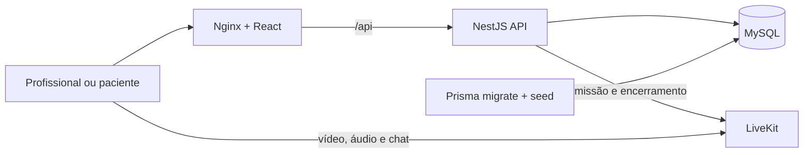

# PAD — Pronto Atendimento Digital

Plataforma de teleatendimento para saúde ocupacional. A pessoa que passa mal no
trabalho entra numa fila assistencial, é triada pela enfermagem por vídeo e,
quando necessário, encaminhada ao médico — sem sair da empresa.

Projeto pessoal. A intenção não foi montar mais um CRUD com videochamada, e sim
atacar as partes deste domínio que **não** se resolvem na interface: disputa por
um recurso compartilhado, autorização por vínculo, imutabilidade de registro
clínico, credenciais efêmeras para quem não tem conta e trilha de auditoria que
sobrevive à tentativa negada.

> **Ambiente de demonstração.** O seed cria usuários de exemplo com uma senha
> definida apenas no ambiente local, e o LiveKit sobe em modo de desenvolvimento. Não use como está para
> dados clínicos reais — o que faltaria está em
> [docs/limitacoes.md](./docs/limitacoes.md).

---

## O problema

### 1. A fila é compartilhada, e isso é uma condição de corrida

Num pronto atendimento físico, duas pessoas não atendem o mesmo paciente porque
alguém precisa andar até ele. Na tela essa exclusão física some: dois cliques
simultâneos no mesmo item da fila são o comportamento normal de uma equipe em
turno cheio.

As duas soluções intuitivas falham:

- **Desabilitar o botão no React.** Duas abas contornam. Um `curl` contorna. E o
  estado local sempre está alguns segundos atrasado em relação ao banco.
- **Checar o status no service antes de gravar.** Entre o `SELECT` e o `UPDATE`
  existe uma janela de milissegundos. Sob concorrência real as duas requisições
  leem `AGUARDANDO` e as duas gravam.

Há ainda o inverso: um mesmo profissional não pode acumular dois atendimentos em
andamento. Essa regra também não sobrevive a uma contagem feita antes da escrita.

### 2. "Médico pode ler prontuário" não é uma permissão

Controle por papel responde *que tipo de recurso* alguém acessa. Não responde
*qual instância*. Um médico autenticado que troca o `:id` da URL pelo
atendimento de outro profissional continua sendo um médico — e o RBAC deixa
passar.

O caminho oposto é igualmente contraintuitivo: o **administrador não pode ver
nenhum dado clínico**. Nem a fila, nem a lista de pacientes, nem o prontuário —
todos exibem nome, contato e classificação de risco. O papel administra
identidade e permissão, não assistência. Isso quebra o padrão implícito de que
"admin pode tudo", e quebrar esse padrão exigiu decidir célula a célula em uma
[matriz de acesso](./docs/matriz-de-acesso.md) escrita **antes** das rotas.

E há um detalhe que parece pedante e não é: responder `404` para um atendimento
inexistente e `403` para um alheio transforma a rota num oráculo de existência.
Basta varrer identificadores e separar as respostas para mapear o sistema. Aqui
os dois casos respondem `403`.

### 3. Um prontuário assinado não é uma linha editável

Registro clínico finalizado tem valor médico-legal. Corrigir não é sobrescrever:
é acrescentar uma retificação assinada e datada, preservando o texto original —
exatamente como no papel.

O problema é que "a aplicação não expõe rota de edição" é uma garantia fraca. Um
script de manutenção, uma migration mal escrita ou um acesso direto ao banco
passam por cima dela sem esforço.

### 4. O paciente não tem conta, e o link é a credencial

Quem é atendido não faz login. Recebe um link e entra. Isso significa que o link
**é** a credencial de acesso a uma consulta médica — e credencial que dura para
sempre é uma porta permanente para uma conversa clínica.

Três coisas precisam ser verdade ao mesmo tempo: o link vale para um único
atendimento, é consumido uma única vez, e morre quando a consulta termina. A
terceira é a mais difícil, porque quem controla a sala de vídeo é um servidor
externo com suas próprias regras de expiração.

### 5. O acesso negado é o registro mais importante

Auditoria em saúde não serve para provar que o sistema funcionou. Serve para
responder *quem olhou o prontuário de fulano, quando, e de onde*. A tentativa
recusada é justamente o evento que interessa investigar — e é a que a maioria
das implementações não grava, porque o pedido morreu antes de chegar ao
controller.

---

## A solução

A tese do projeto cabe em uma linha:

```
constraint no banco  >  transação  >  service  >  controller  >  frontend
```

Cada regra empurrada um nível para baixo elimina uma família inteira de falhas,
não uma falha isolada. A tabela abaixo é o resumo; o detalhe com os mecanismos e
as alternativas descartadas está em [docs/invariantes.md](./docs/invariantes.md).

| Problema | Onde a regra vive | O que sobra para contornar |
|---|---|---|
| Dois profissionais assumem o mesmo atendimento | `UPDATE ... WHERE id = ? AND status = 'AGUARDANDO'` num comando único; zero linhas afetadas vira `409` | Nada. Sob `READ COMMITTED` o InnoDB reavalia o predicado contra a linha já alterada |
| Um profissional acumula dois atendimentos | `CREATE UNIQUE INDEX ... ON ("profissionalId") WHERE status = 'EM_ANDAMENTO'` | Nada. A segunda inserção viola o índice |
| Transição de status fora do grafo | Função pura testada nos 16 pares possíveis, com trigger `BEFORE UPDATE` como segunda barreira | Nada, nem por script |
| Prontuário finalizado é alterado | Trigger que aborta o `UPDATE` quando `finalizadoEm` não é nulo; correção só por adendo | Nada. Adendo e auditoria também são *append-only* por trigger |
| Médico lê atendimento alheio | Guards globais que **negam por padrão**: rota sem papel declarado é rota fechada, e o vínculo com o recurso é conferido no banco | Trocar o `:id` na URL responde `403`, igual a um id inexistente |
| Link do paciente reutilizado | Token opaco de 32 bytes, guardado só como SHA-256, consumido dentro de transação com `SELECT ... FOR UPDATE` | Nada. A segunda troca encontra `usadoEm` preenchido |
| Sala sobrevive ao fim da consulta | A mesma transação que finaliza o atendimento revoga todas as credenciais; depois do commit a API remove os participantes e apaga a sala | O limite é do provedor de vídeo, e está documentado em vez de escondido |
| Acesso não deixa rastro | Interceptor global grava também o `403`, porque os guards registram antes de lançar | — |

Três decisões que valem o comentário:

**Negar por padrão custa o mesmo e falha melhor.** O guard de papel responde
`403` quando a rota *não* declara quem pode chamá-la. A implementação ingênua é
"rota sem restrição é rota liberada"; aqui é o contrário. Esquecer o decorator
produz um erro barulhento na primeira chamada, em vez de um endpoint clínico
aberto que ninguém percebe.

**Encaminhar cria um atendimento novo.** Passar o caso da enfermagem para o
médico não troca o profissional do registro atual — nasce outro atendimento
apontando para o anterior. Sobrescrever perderia quem atendeu o quê, que é
justamente o que a auditoria precisa reconstruir.

**O erro faz parte do contrato.** `409` e `422` não são intercambiáveis: `422`
diz que a operação nunca seria válida, `409` diz que ela era válida e a disputa
foi perdida. O corpo é sempre `{ codigo, mensagem }`, e o frontend decide o que
fazer pelo `codigo` — nunca pelo texto.

---

## Funcionalidades

- Fila com busca por nome ou CPF, filtros combinados de status e risco, e
  recortes de período.
- Perfis `ENFERMEIRO`, `MEDICO` e `ADMIN`, com autorização verificada no backend.
- Cadastro do paciente e entrada na fila como uma operação atômica.
- Triagem com sinais vitais e classificação de risco no padrão Manchester.
- Encaminhamento da enfermagem para o corpo médico preservando o histórico.
- Prontuário imutável após a finalização, com correção por adendo.
- Histórico do paciente recortado pelo perfil de quem consulta.
- Auditoria de leituras permitidas e de tentativas negadas, sem copiar conteúdo
  clínico.
- Sala de vídeo e chat com credencial de no máximo 15 minutos, renovação e link
  opaco de uso único para o paciente.
- Interface responsiva e PWA instalável, com cache restrito ao shell estático.

## Stack

| Camada | Tecnologias |
|---|---|
| Backend | Node.js 24 LTS, NestJS, TypeScript, Zod, Jest e Supertest |
| Dados | MySQL 8, Prisma 7 e migrations versionadas |
| Frontend | React 19, Vite, TypeScript, TanStack Query, React Router, React Hook Form, Zod e Vitest |
| Vídeo e chat | LiveKit Server e SDKs oficiais |
| Infraestrutura | Docker Compose, Dockerfiles multi-stage e Nginx |

## Arquitetura



No Docker o navegador abre o frontend em `https://${DOMAIN}` e a API em
`https://api.${DOMAIN}`. A API usa a rede interna para administrar o LiveKit e
devolve ao navegador `LIVEKIT_PUBLIC_URL`. O banco é o MySQL compartilhado
(`mysql_shared`), não um container deste projeto.

### Estrutura do repositório

```text
.
├── api/
│   ├── prisma/                 # schema, migrations e seed idempotente
│   ├── src/
│   │   ├── atendimento/        # fila, transições, triagem e concorrência
│   │   ├── paciente/           # listagem e histórico autorizado
│   │   ├── prontuario/         # prontuário, finalização e adendos
│   │   ├── sala/               # tokens e integração LiveKit
│   │   ├── usuario/            # administração de usuários
│   │   └── common/             # autenticação, guards, erros e auditoria
│   ├── test/                   # testes E2E com MySQL real
│   └── Dockerfile
├── web/
│   ├── src/app/                # providers e rotas
│   ├── src/features/           # módulos funcionais por domínio
│   ├── src/components/         # componentes compartilhados
│   ├── nginx.conf              # SPA fallback e proxy /api
│   └── Dockerfile
├── docs/                       # regras de domínio e decisões técnicas
├── docker-compose.yml
├── docker-compose.test.yml     # MySQL E2E temporário e isolado
├── sql/                        # scripts manuais (criar banco no mysql_shared)
└── .env.example
```

---

## Execução completa via Docker

Assume Traefik, a rede `traefik`, a rede `mysql_shared` e o container MySQL
compartilhado já existentes no host.

### Pré-requisitos

- Docker com Docker Compose v2.
- Redes externas `traefik` e `mysql_shared`.
- Banco `bevilabs_pad` e usuário `pad` criados administrativamente no MySQL compartilhado,
  com a mesma senha configurada em `MYSQL_PASSWORD` e `DATABASE_URL`.
- Portas `7881/tcp` e `7882/udp` livres no host (mídia WebRTC).
- Pelo menos 2 GB de memória disponível para os containers.

### 1. Configure o ambiente

```powershell
Copy-Item .env.example .env
```

Ajuste `DOMAIN`, `MYSQL_PASSWORD`, `DATABASE_URL`, `JWT_SECRET`,
`LIVEKIT_API_SECRET`, `LIVEKIT_NODE_IP` e `CORS_ORIGIN`. A senha em
`DATABASE_URL` precisa coincidir com `MYSQL_PASSWORD` e estar URL-encoded se
tiver caracteres especiais.

`LIVEKIT_NODE_IP` é o endereço anunciado nos candidatos ICE. Nunca use o IP
interno da bridge do Docker — o navegador não alcança `172.x` e a chamada falha
com `could not establish pc connection` mesmo com o WebSocket conectado.

### 2. Crie o banco (uma vez) e aplique o schema

Crie o schema e o usuário por um canal administrativo seguro do MySQL. Não salve
a senha em scripts versionados. Depois:

```powershell
docker compose config
docker compose run --rm --build migrate
```

As migrations de integridade criam gatilhos no MySQL. Quando o binary log está
ativo, o administrador do MySQL precisa autorizar temporariamente a criação
desses gatilhos antes do primeiro deploy:

```sql
SET GLOBAL log_bin_trust_function_creators = ON;
```

Se uma tentativa anterior falhou em
`20260826180200_gatilho_prontuario_imutavel`, habilite a opção acima, marque
somente essa migration como revertida e reaplique o histórico:

```powershell
docker compose --profile tools run --rm --build migrate npx prisma migrate resolve --rolled-back 20260826180200_gatilho_prontuario_imutavel
docker compose --profile tools run --rm --build migrate
```

Depois que todas as migrations forem aplicadas, o administrador pode restaurar
a proteção padrão do servidor; os gatilhos já criados continuam ativos:

```sql
SET GLOBAL log_bin_trust_function_creators = OFF;
```

Não conceda `SUPER` ao usuário da aplicação. Ele precisa apenas dos privilégios
do próprio schema, incluindo `TRIGGER`, para criar e executar os gatilhos.

Para popular usuários de demonstração, configure `SEED_DEMO_PASSWORD` somente no
`api/.env`, mantenha `NODE_ENV=development` e execute localmente. O seed se recusa
a rodar quando `NODE_ENV=production`:

```powershell
Set-Location api
npm run db:seed
```

### 3. Suba API, frontend e LiveKit

```powershell
docker compose up -d --build
docker compose ps
```

O frontend espera a API ficar saudável (`GET /saude`). O `migrate` não sobe com
`up` — é profile `tools`, one-off.

### 4. Acesse

| Recurso | Endereço |
|---|---|
| Aplicação | `https://${DOMAIN}` |
| Saúde da API | `https://api.${DOMAIN}/saude` |
| Swagger | `https://api.${DOMAIN}/docs` |
| LiveKit WebSocket | `wss://livekit.${DOMAIN}` |

### Testando a chamada em dois contextos

1. Abra a aplicação em uma janela normal e entre como profissional.
2. Libere câmera e microfone no ícone de permissões do navegador.
3. Inicie o atendimento, gere o convite e abra-o em uma janela anônima do mesmo
   navegador.
4. Libere câmera e microfone também na janela do paciente.
5. Confirme vídeo, áudio, queda simulada de conexão e o botão **Reconectar**.

Use duas janelas reais no mesmo computador, não o emulador de celular do
navegador: ele altera o viewport, mas não reproduz de forma confiável
dispositivos de mídia nem a negociação WebRTC.

Câmera e microfone fora de `localhost` exigem HTTPS confiável. O servidor deve
permitir `7881/TCP` e `7882/UDP`. Redes que bloqueiam ambos os transportes
exigem TURN/TLS.

Para acompanhar a inicialização:

```powershell
docker compose logs -f api web livekit
```

Para encerrar:

```powershell
docker compose down
```

## Execução local para desenvolvimento

Usa o MySQL compartilhado (ou qualquer MySQL 8 na máquina) e sobe só o LiveKit
pelo Compose. API e frontend rodam com hot reload no host.

```powershell
# 1. LiveKit
Copy-Item .env.example .env
docker compose up -d livekit

# 2. API (em um terminal)
cd api
Copy-Item .env.example .env
# DATABASE_URL aponta para localhost:3306 — a porta publicada do mysql_shared
npm ci
npx prisma generate
npx prisma migrate deploy
npm run db:seed
npm run start:dev

# 3. Frontend (em outro terminal)
cd web
npm ci
npm run dev
```

A aplicação fica em <http://localhost:5173>, consumindo a API em
<http://localhost:3000>.

## Usuários de demonstração

Criados pelo seed, apenas para desenvolvimento. Todos usam a senha definida em
`SEED_DEMO_PASSWORD`, que fica no `api/.env` ignorado pelo Git e nunca é impressa
nos logs.

| Perfil | E-mail |
|---|---|
| Administrador | `admin@pad.local` |
| Enfermeiro | `ana.ferreira@pad.local` |
| Enfermeiro | `bruno.castro@pad.local` |
| Médico | `carla.nogueira@pad.local` |
| Médico | `diego.ramos@pad.local` |

---

## Testes

Os E2E não são testes de fumaça: eles disparam requisições simultâneas contra o
mesmo atendimento e verificam que exatamente uma vence, reproduzem a matriz de
acesso célula a célula, tentam reutilizar o link do paciente em dois contextos e
conferem que o prontuário finalizado recusa `PATCH` mas aceita adendo.

### Backend unitário

```powershell
cd api
npm test
npm run test:cov
```

### Backend E2E

Não é preciso criar banco manualmente. Com o Docker Desktop em execução:

```powershell
cd api
npm ci
npm run test:e2e:local
```

Esse comando cria um MySQL temporário em um projeto Compose separado na
porta `3307`, aplica migrations e seed do zero, executa a suíte em série e
remove o container ao final — mesmo se um teste falhar. O banco `bevilabs_pad` e os
containers da demonstração não são reutilizados nem interrompidos.

Se a porta `3307` estiver ocupada:

```powershell
$env:PAD_TEST_PORT="55433"
npm run test:e2e:local
Remove-Item Env:PAD_TEST_PORT
```

O comando de baixo nível `npm run test:e2e` continua disponível para ambientes
que já forneçam uma `DATABASE_URL` exclusiva. Como proteção, a
suíte recusa qualquer banco cujo nome não comece com `pad_test`.

### Frontend

```powershell
cd web
npm run lint
npm run build
npm test
```

### PWA

O manifesto e o service worker são gerados apenas no build de produção —
`npm run dev` não demonstra a instalação. Suba o build completo com
`docker compose up -d --build`, abra `https://${DOMAIN}` e use a opção
**Instalar PAD** oferecida pelo navegador.

O cache offline contém somente HTML, CSS, JavaScript, fontes e imagens do shell.
Chamadas `/api`, autenticação, prontuários, pacientes e demais dados
assistenciais permanecem `NetworkOnly` e exigem conexão.

---

## Variáveis principais

| Variável | Uso |
|---|---|
| `DOMAIN` | Host público do frontend; a API fica em `api.${DOMAIN}` |
| `DATABASE_URL` | Conexão Prisma; no Docker o host é `mysql_shared` |
| `MYSQL_HOST` | Sempre `mysql_shared` dentro dos containers |
| `JWT_SECRET` | Assinatura dos tokens dos profissionais |
| `SALA_TOKEN_TTL_SEG` | Vida do token da sala; máximo de 900 segundos |
| `LIVEKIT_URL` | URL interna usada pela API para administrar salas |
| `LIVEKIT_PUBLIC_URL` | URL devolvida ao navegador para entrar na chamada |
| `LIVEKIT_NODE_IP` | IP alcançável anunciado pelo LiveKit nos candidatos ICE |
| `LIVEKIT_API_KEY` | Chave do servidor LiveKit |
| `LIVEKIT_API_SECRET` | Segredo do servidor LiveKit |
| `CORS_ORIGIN` | Origem do frontend (`https://${DOMAIN}`) |

O contrato completo está em [.env.example](./.env.example) e
[api/.env.example](./api/.env.example).

## Documentação

- [Invariantes do sistema](./docs/invariantes.md) — cada regra, onde ela é
  garantida e como verificar.
- [Matriz de acesso](./docs/matriz-de-acesso.md) — cada rota cruzada com cada
  papel e o código HTTP esperado.
- [Glossário do domínio](./docs/glossario.md) — o vocabulário usado no código.
- [Decisões técnicas](./docs/decisoes-tecnicas.md) — o que foi escolhido, o que
  foi descartado e por quê.
- [Limitações conhecidas](./docs/limitacoes.md) — o que este ambiente não é.
